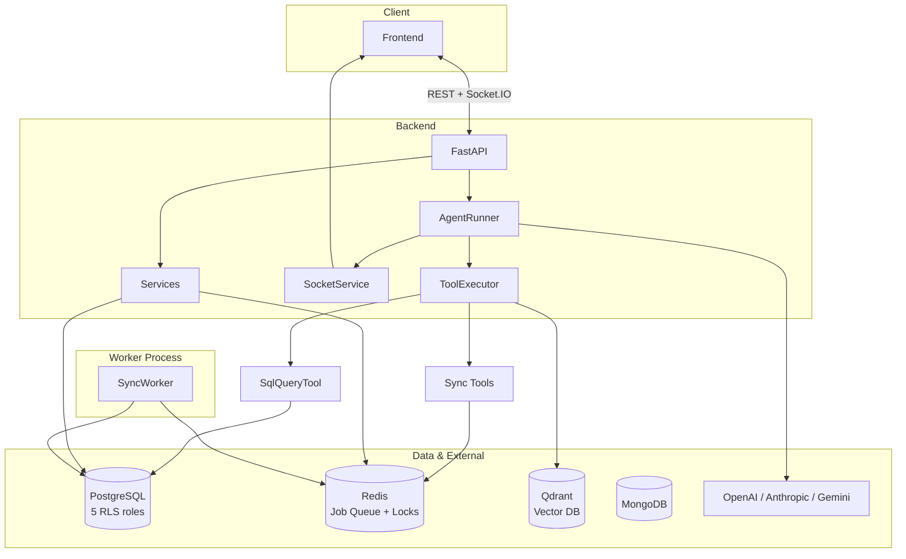

# El Ripley AI Agent — Backend

AI-powered Facebook Fanpage Management System: multi-LLM agents, RLS-secured database access, and real-time communication via Socket.IO.

---

## Overview

This backend powers the El Ripley product: an AI assistant that helps page admins reply to Facebook comments and messages faster. It provides:

- **General Agent**: ReAct-style agent with tools (SQL query, playbooks, sync triggers, media, human-in-the-loop).
- **Suggest Response Agent**: Dedicated pipeline that generates reply suggestions for conversations.
- **Multi-LLM**: OpenAI Responses API, Anthropic, and Google Gemini (with provider-agnostic design).
- **Row-Level Security (RLS)**: PostgreSQL roles (`agent_reader`, `agent_writer`, `suggest_response_reader/writer`) so the AI only accesses data scoped to the current user/page.
- **Real-time**: Socket.IO for streaming agent responses and in-app notifications.

---

## Architecture



**Flow (simplified):**

1. User message → FastAPI → `AgentRunner.run()`.
2. Context is built from Postgres, stored in Redis (temp), then sent to the LLM (OpenAI Responses API streaming).
3. Tool calls (e.g. `sql_query`, `manage_playbook`, sync triggers) are executed; SQL uses RLS-protected Postgres connections.
4. Sync jobs are enqueued in Redis; a separate **SyncWorker** process consumes them and talks to Facebook Graph API.
5. Streaming tokens and events are pushed to the frontend via Socket.IO.

---

## Tech Stack

| Layer | Technology |
|-------|------------|
| API | FastAPI, Uvicorn |
| Real-time | python-socketio (ASGI), Redis adapter for multi-worker |
| Database | PostgreSQL 16 (asyncpg), 5 connection pools with RLS |
| Cache / Queue | Redis (job queue, agent locks, suggest-response dedup) |
| Vector DB | Qdrant (playbook semantic search) |
| Event Store | MongoDB (webhook events) |
| LLM | OpenAI Responses API, Anthropic, Google Gemini |
| Auth | JWT (access + refresh), Facebook OAuth |
| Storage | AWS S3 (media), optional GCP for Vertex |
| Payments | Stripe, Polar, SePay (credits) |
| Deployment | Docker Compose (infra / app / worker split) |

---

## Prerequisites

- Python 3.11+
- [Poetry](https://python-poetry.org/)
- Docker & Docker Compose (for local infra: Postgres, Redis, Qdrant)
- `.env` file (see [Environment Variables](#environment-variables)); copy from `.env.example`.

---

## Quick Start (Local Dev)

1. **Clone and install**

   ```bash
   poetry install --with dev
   ```

2. **Start infrastructure**

   ```bash
   docker compose -f docker-compose.infra.yml up -d
   sleep 3
   ./scripts/init_postgres.sh
   ```

3. **Configure environment**

   Copy `.env.example` to `.env` and set at least:

   - `OPENAI_API_KEY`
   - `JWT_SECRET_KEY`
   - `ENCRYPTION_KEY`
   - `POSTGRES_PASSWORD`, `REDIS_PASSWORD` (and any other DB/Redis passwords if not using defaults from `.env.example`)

4. **Run the API server**

   ```bash
   poetry run python src/main.py
   ```

   Server listens at `http://localhost:8000`. Interactive API docs: `http://localhost:8000/docs`.

5. **Run the sync worker (optional, for Facebook sync jobs)**

   ```bash
   poetry run python src/workers/sync_worker.py
   ```

---

## Running Tests

- **Unit and integration tests (pytest)**

  ```bash
  poetry run pytest tests/unit/ tests/integration/ -v
  ```

- **With coverage**

  ```bash
  poetry run pytest tests/unit/ tests/integration/ --cov=src --cov-report=term-missing --cov-report=html
  ```

- **Using Make (if available)**

  ```bash
  make test
  make test-coverage
  ```

Script-style tests (not pytest):

- **SQL Tool RLS security** (requires running Postgres with seeded data):

  ```bash
  poetry run python tests/test_sql_tool_rls.py
  ```

- **Anthropic proxy** (optional; needs `ANTHROPIC_PROXY_API_KEY` in env):

  ```bash
  poetry run python tests/test_anthropic_proxy.py
  poetry run python tests/test_anthropic_proxy.py --anthropic
  ```

---

## API Documentation

- **Swagger UI**: `http://localhost:8000/docs`
- **ReDoc**: `http://localhost:8000/redoc`
- **Root** (`GET /`): Returns service name and list of endpoint groups (auth, Facebook, users, OpenAI conversations, suggest-response, billing, escalations, notifications, websocket).

---

## Project Structure

```
├── src/
│   ├── main.py              # FastAPI app, lifespan, routers, exception handlers
│   ├── settings.py          # Environment-based config
│   ├── api/                 # REST routers (auth, users, facebook, billing, etc.)
│   ├── agent/               # General agent + suggest-response agent, tools, context
│   ├── services/            # Business logic (auth, notifications, facebook sync, etc.)
│   ├── database/            # Postgres (repos, RLS), Mongo, Qdrant
│   ├── redis_client/        # Redis clients (job queue, locks, agent context, cache)
│   ├── middleware/          # Auth dependency, exception handlers
│   ├── socket_service/      # Socket.IO event emission
│   ├── workers/             # Sync worker (Facebook sync jobs)
│   ├── billing/             # Credits, payment webhooks
│   ├── common/              # Shared types, S3 client, HTTP/embedding clients
│   └── utils/               # Logger, serialization, encryption, token estimation
├── tests/
│   ├── unit/                # Pytest unit tests
│   ├── integration/         # Pytest API integration tests
│   ├── llm_providers/        # LLM provider evidence scripts (not pytest)
│   ├── test_sql_tool_rls.py # RLS security test script
│   └── test_anthropic_proxy.py
├── docs/                    # Design and ops documentation
├── scripts/                  # init_postgres.sh, install-dependencies.sh, etc.
├── docker-compose.infra.yml # Postgres, Redis, Qdrant
├── docker-compose.app.yml   # API server container
├── docker-compose.worker.yml# Sync worker container
├── Dockerfile
├── pyproject.toml
└── .env.example
```

---

## Environment Variables

See `.env.example` for the full list. Main groups:

| Group | Examples |
|-------|----------|
| App | `APP_ENV`, `DEBUG`, `LOG_LEVEL`, `BACKEND_URL`, `ALLOWED_FRONTEND_URLS` |
| Auth | `JWT_SECRET_KEY`, `JWT_ALGORITHM`, `ENCRYPTION_KEY`, token expiry |
| LLM | `OPENAI_API_KEY`, `ANTHROPIC_API_KEY_PROXY`, `GOOGLE_API_KEY` / Vertex vars |
| PostgreSQL | `POSTGRES_*`, `POSTGRES_AGENT_READER_*`, `POSTGRES_AGENT_WRITER_*`, suggest_response reader/writer |
| Redis | `REDIS_HOST`, `REDIS_PORT`, `REDIS_PASSWORD`, `REDIS_DB` |
| MongoDB | `MONGODB_*` |
| Qdrant | `QDRANT_HOST`, `QDRANT_PORT_REST`, `QDRANT_PORT_GRPC` |
| Facebook | `FB_APP_ID`, `FB_APP_SECRET`, `FB_WEBHOOK_VERIFY_TOKEN` |
| AWS S3 | `AWS_ACCESS_KEY_ID`, `AWS_SECRET_ACCESS_KEY`, `AWS_REGION`, `AWS_BUCKET_NAME` |
| Payments | Stripe, Polar, SePay (see `.env.example`) |

For the proxy test script: `ANTHROPIC_PROXY_API_KEY` (optional).

---

## Docker Deployment

- **Infrastructure only** (Postgres, Redis, Qdrant):

  ```bash
  docker compose -f docker-compose.infra.yml up -d
  ```

- **App + Worker** (assume `ai_agent_network` exists from infra):

  ```bash
  docker compose -f docker-compose.app.yml up -d
  docker compose -f docker-compose.worker.yml up -d
  ```

- **Full local reset** (data volumes removed, then init DB):

  ```bash
  docker compose -f docker-compose.infra.yml down -v
  docker compose -f docker-compose.infra.yml up -d
  sleep 3
  ./scripts/init_postgres.sh
  poetry run python src/main.py
  ```

---

## Contributing

See [CONTRIBUTING.md](CONTRIBUTING.md) for setup, branch naming, pre-commit hooks, and test requirements before submitting changes.
