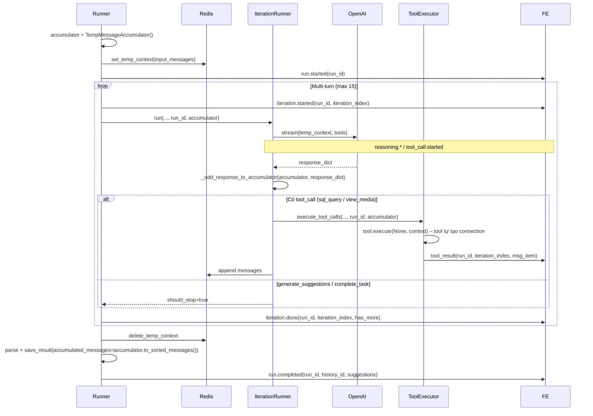

# Suggest Response Agent – Core & Database

> Tài liệu tổng hợp: thiết kế core (multi-turn, tools, socket events), cấu trúc code, database (schema, roles, RLS, connection pools) và cách dùng cho suggest_response_agent.

---

## Phần 1. Tổng quan

Suggest_response_agent là agent “lock-in” với **một** cuộc hội thoại Facebook (messages hoặc comments). Thiết kế gồm hai phần chính:

**Core**
- **Oneshot**: Mỗi trigger build context 1 lần, chạy đến hoàn thành.
- **Multi-turn nội bộ**: LLM có thể gọi tools (sql_query, view_media, change_media_retention) nhiều lần trước khi gọi terminal tool: `generate_suggestions` hoặc `complete_task` (chỉ khi trigger bởi general_agent).
- **Tools riêng biệt**: sql_query và view_media dùng description tối ưu cho suggest_response, không ảnh hưởng general_agent.
- **Socket events**: run/iteration/reasoning/tool lifecycle (run.started, iteration.started, reasoning.*, tool_call.started, tool_result, iteration.done, run.completed, run.error).
- **Tool tự quản lý connection**: sql_query và view_media detect context qua `ToolCallContext` và tự tạo connection; tool_executor không phân nhánh theo từng tool.
- **Lưu đầy đủ message items**: Accumulator gom toàn bộ messages (reasoning, tool call, tool output) qua mọi iteration và lưu vào `suggest_response_message`.

**Database & connections**
- **Bảng mới**: `conversation_agent_blocks`, `agent_escalations`.
- **Roles**: `suggest_response_reader`, `suggest_response_writer` (ít quyền, conversation-scoped).
- **RLS**: Policy riêng trong `99_rls_suggest_response.sql`.
- **Schema**: Tách thành memory, suggest_response, agent_comm.
- **App**: Settings + connection pools (reader/writer) trong `connection.py`.

---

## Phần 2. Architecture

```
┌─────────────────┐     trigger_suggest_response()      ┌──────────────────────────────┐
│ General Agent   │ ──────────────────────────────────► │ TriggerSuggestResponseTool   │
└─────────────────┘                                    └──────────────────────────────┘
                                                                       │
                                                                       ▼
┌─────────────────────────────────────────────────────────────────┐
│  SuggestResponseOrchestrator                                     │
│  - Lock / queue / hash / balance check                           │
│  - trigger_source: api_manual | api_auto | webhook | general_agent│
└──────────────────────────┬──────────────────────────────────────┘
                           │
                           ▼
┌─────────────────────────────────────────────────────────────────┐
│  SuggestResponseRunner                                           │
│  - _prepare_context() → SuggestResponseContextBuilder            │
│  - _run_iteration_loop() → multi-turn loop                       │
│  - persistence.save_result()                                     │
└──────────────────────────┬──────────────────────────────────────┘
                           │
         ┌─────────────────┼─────────────────┐
         ▼                 ▼                 ▼
┌──────────────┐  ┌──────────────┐  ┌──────────────────┐
│ SuggestResp  │  │ Redis Temp   │  │ SuggestResponse  │
│ IterationRun │  │ Context      │  │ Persistence      │
└──────┬───────┘  └──────────────┘  └──────────────────┘
       │
       ├── SuggestResponseStreamHandler (stream LLM, emit events)
       ├── SuggestResponseToolExecutor (execute tools)
       └── SuggestResponseToolRegistry (sql_query, view_media, change_media_retention, generate_suggestions, complete_task)
```

---

## Phần 3. Flow multi-turn



---

## Phần 3.5. Trigger action và thẻ `<trigger>`

Mỗi lần suggest_response_agent được trigger, **context_builder** luôn inject một **thẻ `<trigger>`** vào **last user message** của context. Agent dựa vào đó để biết *vì sao* mình được gọi và chọn terminal tool phù hợp (`generate_suggestions` hoặc `complete_task`).

### 3.5.1 trigger_action (giá trị)

| trigger_action | Ý nghĩa | Kỳ vọng |
|----------------|---------|---------|
| `new_customer_message` | Khách hàng vừa gửi tin nhắn mới | Phân tích và gọi `generate_suggestions` |
| `operator_request` | Operator / general_agent chủ động yêu cầu gợi ý | Tạo suggestions mới |
| `escalation_update` | Escalation thread có hoạt động mới (operator/general_agent trả lời) | Xem `<escalation_history>`; nếu ảnh hưởng cách trả lời thì `generate_suggestions`, không thì `complete_task` |
| `routine_check` | Kiểm tra định kỳ, không có sự kiện cụ thể | Thường `complete_task` trừ khi có thay đổi đáng kể |

### 3.5.2 Ánh xạ trigger_source → trigger_action

| Nguồn trigger | trigger_action |
|---------------|----------------|
| **webhook** (bất kỳ) | `new_customer_message` (webhook fire khi có tin mới) |
| **api_manual** (user bấm "generate") | `operator_request` |
| **api_auto** (FE auto trigger) | `routine_check` |
| **general_agent** + `trigger_reason="escalation_response"` | `escalation_update` |
| **general_agent** + `trigger_reason="send_message"` | `operator_request` |
| **general_agent** + `trigger_reason="review"` hoặc không truyền | `routine_check` |

### 3.5.3 Luồng dữ liệu

- **trigger_resolver**: Trả về `TriggerResolution` gồm `trigger_type` (log/persistence), `trigger_action` (cho agent), `delivery_mode`, `settings`, `num_suggestions`.
- **orchestrator** → **runner** → **context_builder**: Truyền `trigger_action` xuống; `context_builder.build_context(trigger_action=...)` inject nội dung tương ứng vào last user message.
- **Nội dung inject**: Hằng `TRIGGER_MESSAGES` trong `context_builder.py` (dạng `<trigger action="...">...</trigger>` kèm câu hướng dẫn ngắn). System prompt có thêm một dòng trong "Context Tags Reference" giải thích thẻ `<trigger>`.

### 3.5.4 Vị trí inject trong context

- **Messages (last turn = user)**: Block đầu tiên của last user message = trigger, sau đó escalation (nếu có), ad_context (nếu có), rồi đến nội dung tin nhắn khách hàng.
- **Messages (last turn = assistant hoặc empty conversation)**: Tạo một user message mới chỉ chứa trigger + escalation/ad (nếu có); trường empty conversation còn thêm dòng `[Empty conversation — no customer messages yet.]`.
- **Comments**: Một user message duy nhất; block đầu tiên = trigger, sau đó escalation, rồi `<conversation_data>`.

**Tóm lại**: Mọi trigger đều có đúng một thẻ `<trigger>` trong last user message; agent không cần đoán lý do kích hoạt.

---

## Phần 4. Tools

### 4.1 Danh sách tools

| Tool                   | Mô tả ngắn                                           | DB Connection              | conversation_type |
|------------------------|------------------------------------------------------|----------------------------|-------------------|
| `sql_query`            | SELECT/INSERT/UPDATE/DELETE trong scope 6 bảng RLS   | **Tool tự tạo**: suggest_response reader/writer khi có context; general_agent dùng conn truyền vào | messages, comments |
| `view_media`           | Load hình vào context để phân tích                   | **Tool tự tạo**: suggest_response_reader khi có context; general_agent dùng `get_agent_reader_connection(user_id)` | messages, comments |
| `change_media_retention` | Điều chỉnh thời gian giữ media                     | Không dùng DB              | messages only |
| `generate_suggestions` | Tool bắt buộc cuối – sinh gợi ý trả lời             | Không dùng DB              | messages, comments |
| `complete_task`        | Terminal tool – hoàn thành việc KHÔNG gửi tin nhắn   | Không dùng DB              | messages, comments (luôn có) |

Tool_executor truyền `ToolCallContext` (có thêm `fb_conversation_type`, `fb_conversation_id`, `fan_page_id`, `page_scope_user_id` cho suggest_response) và gọi `tool.execute(None, context, arguments)`; mỗi tool tự tạo connection nếu cần.

### 4.2 Tool loading

Cả hai terminal tools (`generate_suggestions`, `complete_task`) **luôn** được load cho mọi trigger. Agent chọn tool kết thúc dựa trên thẻ `<trigger>` trong last user message (xem Phần 3.5). Các tool khác (sql_query, view_media, change_media_retention) theo conversation_type như trước.

### 4.3 Custom descriptions

- **sql_query**: Scope `page_scope_user_memory`, `memory_blocks`, `memory_block_media`, `media_assets`, `conversation_agent_blocks`, `agent_escalations`. Mô tả riêng cho messages vs comments.
- **view_media**: Load hình đính kèm (đọc `media_assets` qua suggest_response_reader).

File: `src/agent/suggest_response/tools/override_descriptions/` – `tool_descriptions.py`, `sql_query_messages.md`, `sql_query_comments.md`, `view_media.md`

### 4.4 Description override

`BaseTool` hỗ trợ `description_override`. Khi register cho suggest_response: `SqlQueryTool(description_override=SR_SQL_QUERY_*_DESCRIPTION)`, `ViewMediaTool(description_override=SR_VIEW_MEDIA_DESCRIPTION)`.

---

## Phần 5. DB connections (tool tự quản lý)

### 5.1 ToolCallContext mở rộng

`src/agent/tools/base.py` – `ToolCallContext` có thêm (optional, None cho general_agent):

- `fb_conversation_type`: 'messages' \| 'comments'
- `fb_conversation_id`: str
- `fan_page_id`: str
- `page_scope_user_id`: str \| None (PSID, chỉ với messages)

### 5.2 sql_query

- **Suggest_response**: Tool kiểm tra context; nếu có thì **tự gọi** `get_suggest_response_reader_connection(...)` hoặc `get_suggest_response_writer_transaction(...)`.
- **General_agent**: Dùng `conn` do caller truyền vào.

### 5.3 view_media

- **Suggest_response**: Detect context giống sql_query; tự gọi `get_suggest_response_reader_connection(...)` để đọc `media_assets`.
- **General_agent**: Khi `conn=None`, gọi `get_agent_reader_connection(context.user_id)`.

---

## Phần 6. Socket events

Tất cả emit qua `suggest_response.event`; payload có `conversation_type`, `conversation_id`, `event_name` và data theo từng event.

| event_name           | Khi nào               | Data bổ sung |
|----------------------|------------------------|--------------|
| `run.started`        | Bắt đầu agent run     | `run_id` |
| `iteration.started`  | Bắt đầu mỗi iteration | `run_id`, `iteration_index` |
| `reasoning.started`  | LLM bắt đầu reasoning | `run_id`, `iteration_index`, `msg_id` |
| `reasoning.delta`    | Streaming reasoning   | `run_id`, `msg_id`, `delta` |
| `reasoning.done`     | Reasoning hoàn thành   | `run_id`, `msg_id`, `content` |
| `tool_call.started`  | LLM gọi tool          | `run_id`, `iteration_index`, `msg_item` |
| `tool_result`        | Tool execute xong     | `run_id`, `iteration_index`, `msg_item` |
| `iteration.done`     | Kết thúc iteration     | `run_id`, `iteration_index`, `has_more` |
| `run.completed`      | Agent hoàn thành       | `run_id`, `history_id`, `suggestions`, `suggestion_count` [, `task_summary` khi complete_task] |
| `run.error`          | Lỗi                    | `run_id`, `error` [, `code`] |

Chi tiết payload cho FE: [SUGGEST_RESPONSE_SOCKET_EVENTS_FE.md](./SUGGEST_RESPONSE_SOCKET_EVENTS_FE.md).

---

## Phần 7. Database schema

### 7.1 Refactor schema (3 file)

| File | Mục đích | Bảng |
|------|----------|------|
| `04_schema_memory.sql` | Memory | `page_memory`, `page_scope_user_memory`, `user_memory`, `memory_blocks` |
| `04a_schema_suggest_response.sql` | Config & history | `suggest_response_agent`, `page_admin_suggest_config`, `suggest_response_history`, `suggest_response_message` |
| `04b_schema_agent_comm.sql` | Giao tiếp & chặn | `conversation_agent_blocks`, `agent_escalations` |

Thứ tự load: `04_schema_memory.sql` → `04a_schema_suggest_response.sql` → `04b_schema_agent_comm.sql`.

### 7.2 Bảng mới

**conversation_agent_blocks**
- Đánh dấu conversation bị **block** khỏi trigger suggest_response (tránh abuse / burn token).
- Polymorphic: `conversation_type` + `facebook_conversation_messages_id` hoặc `facebook_conversation_comments_id`.
- Cột: `blocked_by`, `reason`, `is_active`, timestamps.

**agent_escalations**
- Kênh hai chiều: agent tạo request → user/general_agent ghi response → agent đọc response.
- Cột request: `request_summary`, `request_detail`, `request_context`, `priority`.
- Cột response: `response_content`, `responded_by`, `responded_at`.
- Status: `pending` \| `resolved` \| `dismissed`.

---

## Phần 8. Roles PostgreSQL

- **General agent**: `agent_reader`, `agent_writer` (đã có).
- **Suggest Response**: `suggest_response_reader` (SELECT, conversation-scoped), `suggest_response_writer` (INSERT/UPDATE/DELETE trên 6 bảng, conversation-scoped).

Định nghĩa: `00_init_agent_role.sql`.

---

## Phần 9. Grants

- **General agent**: Facebook, memory, suggest_response config/history/message, media; bảng mới `conversation_agent_blocks`, `agent_escalations` (SELECT cả hai, write chỉ `agent_writer`).
- **Suggest Response** (chỉ 6 bảng):

| Bảng | suggest_response_reader | suggest_response_writer |
|------|-------------------------|-------------------------|
| `page_scope_user_memory` | SELECT | INSERT, UPDATE |
| `memory_blocks` | SELECT | INSERT, UPDATE, DELETE |
| `memory_block_media` | SELECT | INSERT, DELETE |
| `media_assets` | SELECT | — |
| `conversation_agent_blocks` | SELECT | INSERT |
| `agent_escalations` | SELECT | INSERT |

Dữ liệu khác (messages, comments, …) do context_builder lấy bằng connection hệ thống; suggest_response không đọc trực tiếp.

---

## Phần 10. Row Level Security (RLS)

- **General agent** (`99_rls_policies.sql`): RLS theo `app.current_user_id` và pages user có quyền.
- **Suggest Response** (`99_rls_suggest_response.sql`):
  - Session variables: `app.current_user_id`, `app.current_conversation_type`, `app.current_conversation_id`, `app.current_fan_page_id`, `app.current_page_scope_user_id`.
  - Helper functions: `get_sr_current_*` (SECURITY DEFINER).
  - Policy theo từng bảng (page_scope_user_memory, memory_blocks, memory_block_media, media_assets, conversation_agent_blocks, agent_escalations); DEFAULT cột cho owner_user_id, fan_page_id, conversation_type, … từ session.

---

## Phần 11. App: Settings & connection pools

### 11.1 Settings (`src/settings.py`)

| Env | Mô tả | Default (dev) |
|-----|--------|----------------|
| `POSTGRES_SUGGEST_RESPONSE_READER_USER` | User DB reader | `suggest_response_reader` |
| `POSTGRES_SUGGEST_RESPONSE_READER_PASSWORD` | Mật khẩu reader | `suggest-response-reader-dev-password` |
| `POSTGRES_SUGGEST_RESPONSE_WRITER_USER` | User DB writer | `suggest_response_writer` |
| `POSTGRES_SUGGEST_RESPONSE_WRITER_PASSWORD` | Mật khẩu writer | `suggest-response-writer-dev-password` |

### 11.2 Connection pools (`src/database/postgres/connection.py`)

- **Pools**: `_suggest_response_reader_pool` (min 3, max 15), `_suggest_response_writer_pool` (min 2, max 8).
- **Reader**: `get_suggest_response_reader_connection(user_id, conversation_type, conversation_id, fan_page_id, page_scope_user_id=None)` – set session variables rồi yield connection.
- **Writer**: `get_suggest_response_writer_transaction(...)` – cùng 5 tham số, `SET LOCAL` trong transaction.
- **Startup/Shutdown**: Khởi tạo/đóng trong `startup_async_database()` / `shutdown_async_database()`.
- Tools `sql_query` và `view_media` **tự gọi** reader/writer khi có context (ToolCallContext).

---

## Phần 12. Cách dùng connection trong code

**Đọc (SELECT):**
```python
async with get_suggest_response_reader_connection(
    user_id=owner_user_id,
    conversation_type="messages",
    conversation_id=fb_conversation_id,
    fan_page_id=fan_page_id,
    page_scope_user_id=psid,
) as conn:
    rows = await conn.fetch("SELECT * FROM page_scope_user_memory WHERE ...")
```

**Ghi (memory, block, escalation):**
```python
async with get_suggest_response_writer_transaction(
    user_id=owner_user_id,
    conversation_type="messages",
    conversation_id=fb_conversation_id,
    fan_page_id=fan_page_id,
    page_scope_user_id=psid,
) as conn:
    await conn.execute("INSERT INTO agent_escalations (...) VALUES (...)")
```

**Webhook – kiểm tra block:** Dùng connection hệ thống (app user), không dùng suggest_response pool; query `conversation_agent_blocks` với `is_active = TRUE` cho conversation; nếu có thì skip trigger.

---

## Phần 13. Cấu trúc code

```
src/agent/suggest_response/
├── __init__.py
├── schemas.py
├── context/
│   ├── context_builder.py
│   ├── formatter/
│   └── prompts/
│       ├── prompt_loader.py
│       ├── system_prompt_messages.md
│       └── system_prompt_comments.md
├── core/
│   ├── runner.py
│   ├── iteration_runner.py
│   └── run_config.py
├── socket/
│   ├── emitter.py
│   └── stream_handler.py
├── tools/
│   ├── complete_task.py
│   ├── generate_suggestions.py
│   ├── tool_registry.py
│   ├── tool_executor.py
│   └── override_descriptions/
│       ├── tool_descriptions.py
│       ├── sql_query_messages.md
│       ├── sql_query_comments.md
│       └── view_media.md
├── utils/
│   ├── message_accumulator.py
│   ├── iteration_warning.py
│   ├── persistence.py
│   ├── response_parser.py
│   └── prompt_logger.py
└── orchestration/
    ├── orchestrator.py
    ├── trigger_resolver.py
    ├── condition_checker.py
    └── graph_api_delivery.py
```

**General Agent tool:** `src/agent/tools/orechetrate_tool/trigger_suggest_response.py` – `TriggerSuggestResponseTool`

**Import:** `from src.agent.suggest_response import SuggestResponseRunner, InsufficientBalanceError`

---

## Phần 14. Files tham chiếu

| File | Nội dung |
|------|----------|
| `sql/00_init_agent_role.sql` | 4 roles (agent_*, suggest_response_*) |
| `sql/04_schema_memory.sql`, `04a_schema_suggest_response.sql`, `04b_schema_agent_comm.sql` | Schema |
| `sql/elripley.sql` | Import schema, grants, RLS |
| `sql/99_rls_policies.sql`, `sql/99_rls_suggest_response.sql` | RLS |
| `src/settings.py` | Env suggest_response_reader/writer |
| `src/database/postgres/connection.py` | Pools, get_suggest_response_reader_connection, get_suggest_response_writer_transaction |
| `src/agent/suggest_response/socket/emitter.py` | Emit run.*, iteration.*, reasoning.*, tool_call.started, tool_result |
| `src/agent/suggest_response/core/runner.py` | run_id, _run_iteration_loop, save_result |
| `src/agent/suggest_response/orchestration/trigger_resolver.py` | Resolve trigger_type, trigger_action, delivery_mode (suggest/respond) |
| `src/agent/suggest_response/orchestration/condition_checker.py` | Check điều kiện trigger (webhook_suggest cần admin online) |
| `src/agent/suggest_response/context/context_builder.py` | Build context, inject `<trigger>` (TRIGGER_MESSAGES) vào last user message |
| `src/agent/suggest_response/context/prompts/prompt_loader.py` | Load system prompt theo conversation_type; Context Tags Reference có mô tả `<trigger>` |
| `src/agent/tools/orechetrate_tool/trigger_suggest_response.py` | TriggerSuggestResponseTool cho general agent |

---

## Phần 15. .env mẫu

```env
POSTGRES_SUGGEST_RESPONSE_READER_USER=suggest_response_reader
POSTGRES_SUGGEST_RESPONSE_READER_PASSWORD=suggest-response-reader-dev-password
POSTGRES_SUGGEST_RESPONSE_WRITER_USER=suggest_response_writer
POSTGRES_SUGGEST_RESPONSE_WRITER_PASSWORD=suggest-response-writer-dev-password
```

---

## Phần 16. Cách test

1. Trigger suggest_response (manual hoặc webhook) cho conversation có sẵn.
2. Kiểm tra socket events: run.started → iteration.started → reasoning.* / tool_call.started → tool_result / iteration.done → run.completed (hoặc run.error).
3. Kiểm tra gợi ý trả lời và lịch sử: `suggest_response_message` chứa đủ reasoning, function_call, function_call_output từ mọi iteration.
4. Nếu dùng sql_query/view_media: kiểm tra tool_call.started, tool_result và pools trong connection.py nếu debug.
5. General agent trigger: Gọi `trigger_suggest_response` với `trigger_reason` phù hợp; kiểm tra last user message trong log có thẻ `<trigger action="...">` và agent chọn đúng `generate_suggestions` / `complete_task`.

---

## Phần 17. Trigger Suggest Response (General Agent)

Công cụ `trigger_suggest_response` cho phép **general agent** gọi suggest_response agent chủ động:

1. Gửi tin nhắn trực tiếp đến khách hàng qua Graph API (khi `auto_send=true`)
2. Yêu cầu suggest_response xử lý escalation vừa trả lời mà không gửi tin nhắn (dùng `complete_task`)
3. Yêu cầu suggest_response review lại conversation (không có sự kiện cụ thể)

### 17.1 Luồng xử lý

1. General agent gọi tool `trigger_suggest_response` với `trigger_reason` (optional), `auto_send`, `conversation_type`, `conversation_id`, `fan_page_id`
2. Tool resolve `page_admin` từ `fan_page_id` (để có `access_token` khi `auto_send=true`)
3. Orchestrator trigger với `trigger_source="general_agent"`, truyền `trigger_reason` vào resolver
4. Resolver trả về `trigger_action`: `escalation_response` → `escalation_update`, `send_message` → `operator_request`, `review` hoặc null → `routine_check`
5. Context_builder inject thẻ `<trigger action="...">` vào last user message (xem Phần 3.5)
6. Suggest_response nhận unified system prompt + context (có sẵn `<trigger>`); agent chọn `generate_suggestions` hoặc `complete_task`
7. Kết quả format và trả về general agent

### 17.2 System prompt (unified)

Prompt loader: `build_system_prompt(conversation_type, ...)` – 1 prompt per conversation_type, không chia theo trigger_type. Cả hai terminal tools (`generate_suggestions`, `complete_task`) luôn available. Phần "Context Tags Reference" có mô tả thẻ `<trigger>`.

### 17.3 trigger_suggest_response – Parameters

| Parameter | Type | Required | Mô tả |
|-----------|------|----------|-------|
| conversation_type | "messages" \| "comments" | Yes | Loại hội thoại Facebook |
| conversation_id | string | Yes | ID hội thoại |
| fan_page_id | string | Yes | Facebook page ID |
| auto_send | boolean | No (default: false) | Tự động gửi suggestion đầu tiên qua Graph API |
| trigger_reason | "escalation_response" \| "send_message" \| "review" | No | Lý do general_agent gọi suggest_response: `escalation_response` = vừa trả lời escalation, `send_message` = muốn gửi tin cho khách, `review` = review conversation |

### 17.4 Use cases

1. **General agent muốn gửi tin nhắn trực tiếp cho khách hàng**
   - Gọi `trigger_suggest_response(trigger_reason="send_message", auto_send=true)`
   - trigger_action = `operator_request` → context có `<trigger action="operator_request">`; suggest_response tạo suggestions → orchestrator deliver qua Graph API

2. **General agent vừa trả lời escalation và muốn suggest_response xử lý ngay**
   - Gọi `trigger_suggest_response(trigger_reason="escalation_response")`
   - trigger_action = `escalation_update` → agent xem `<escalation_history>` và quyết định `generate_suggestions` hoặc `complete_task`

3. **General agent muốn suggest_response phân tích / review (không gửi)**
   - Gọi `trigger_suggest_response(trigger_reason="review")` hoặc không truyền `trigger_reason`
   - trigger_action = `routine_check` → thường agent gọi `complete_task` trừ khi có thay đổi đáng kể

### 17.5 Files liên quan

- `src/agent/tools/orechetrate_tool/trigger_suggest_response.py` – `TriggerSuggestResponseTool`
- `src/agent/tools/registry.py` – Register tool khi `suggest_response_orchestrator` được cung cấp
- `src/agent/general_agent/core/agent_runner.py` – Truyền orchestrator vào registry
- `src/main.py` – Khởi tạo và inject orchestrator

---

## Liên kết

- [SUGGEST_RESPONSE_SOCKET_EVENTS_FE.md](./SUGGEST_RESPONSE_SOCKET_EVENTS_FE.md) – Contract socket events cho Frontend (payload, flow, TypeScript types).
